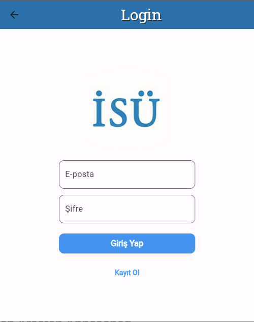
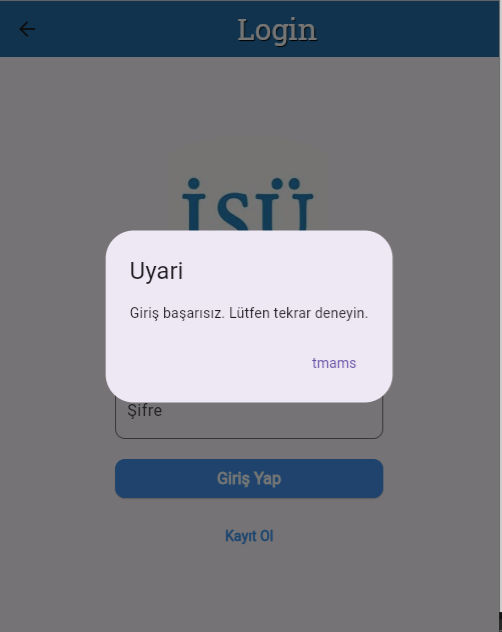
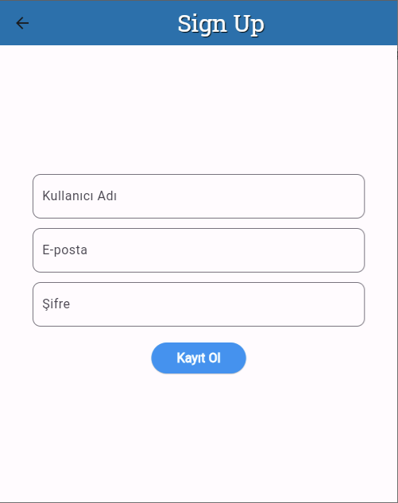
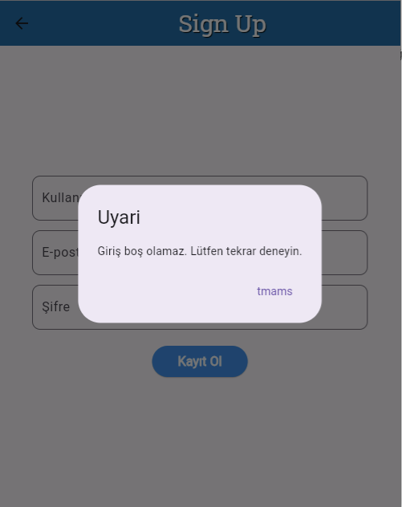
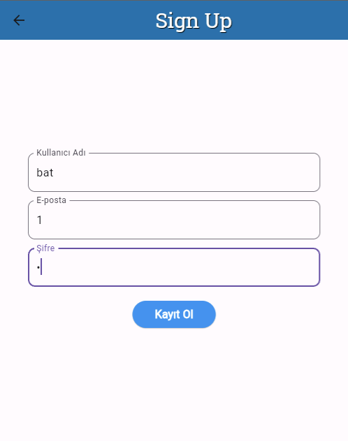
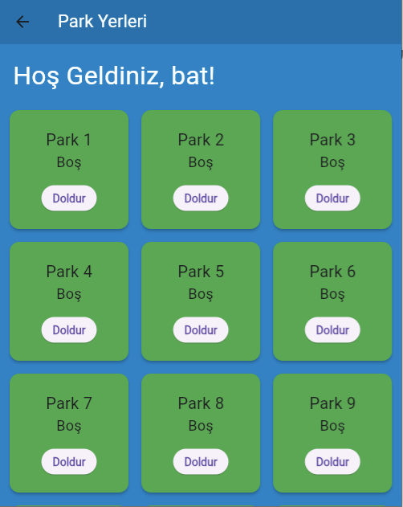
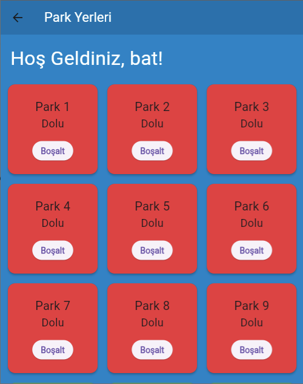
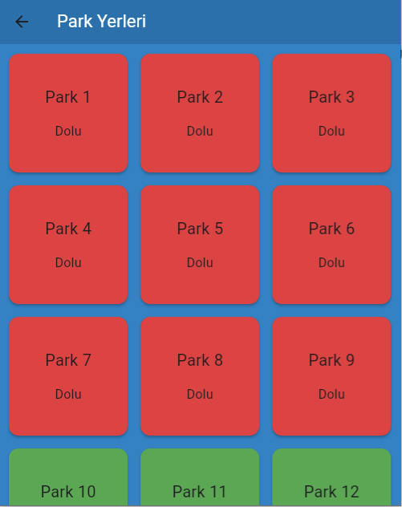
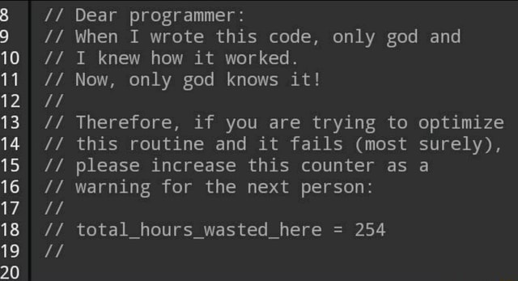

# ISULOT
Öncelikle şunu söylemek isterim ki hazırladığım uygulama bakıldığında sadece okulumuz amaçlı değil, herhangi bir otoparkta da kullanılabilir ama uygulamaya bir isim vermek ve rengini mavi temalı yapabilmek için ISULOT koydum ve bu bahsettiğim konudan ötürü de dosya adını parking_lot olarak bırakmak istedim. Tanıtmak gerekirse bu uygulama, okulumuzdaki az olan park yeri sorunundan ötürü, okula araba veya toplu taşıma ile gelmenin daha mantıklı olup olmayacağını hesaplamamız için boş ve dolu olan park yerlerini gösteren bir uygulamadır.

---
# Ekran Görüntüleri
#### Hoş geldiniz sayfası

---
#### Giriş sayfası

---
#### Hatalı giriş uyarısı

---
#### Kayıt sayfası

---
#### Hatalı kayıt uyarısı

---
#### Örnek kayıt sayfası

---
#### Personel sayfası

---
#### Doldurulmuş personel sayfası

---
#### Misafir sayfasında dolu park yerleri

---

---
# Takım Üyeleri
- Mustafa Batuhan Yeşilkaya / 229920529 /  Mobil Programlamaya Giriş

# Ders Adı
### Mobil Programlamaya Giriş

# Supervisor
### Keyvan Arasteh Abbasabad